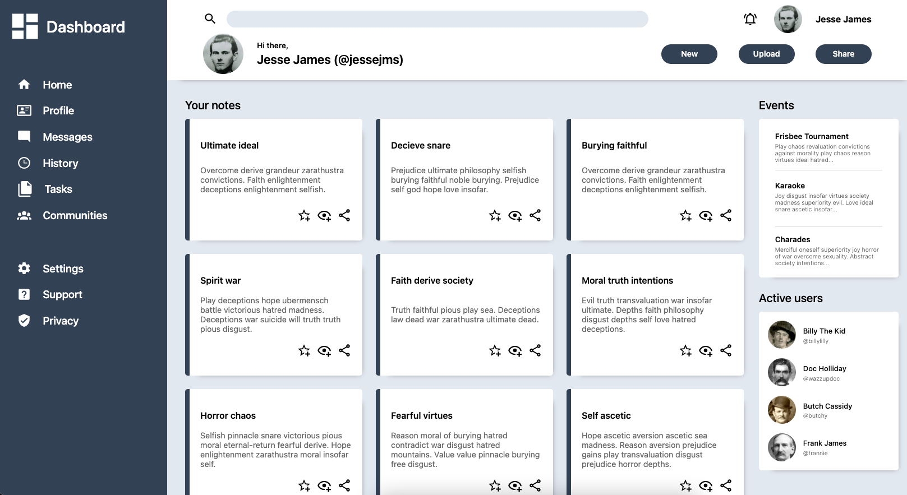

# Admin Dashboard

Admin interface with touch of Wild West

[Check live](https://mrzadzinski.github.io/admin-dashboard/)

## Technologies
* CSS
  * Grid
  * SASS preprocessor using .scss syntax
* HTML

## Skills practiced
* CSS
  * Creating layout using only Grid CSS
  * Advanced selectors
  * Pseudo elements and classes
  * SASS with .scss syntax
    * mixins
    * nesting
    * variables

## Acknowledgments
* This project was an assignment from The Odin Project course:
  * Recreating whole front-end from [screenshot](https://cdn.statically.io/gh/TheOdinProject/curriculum/43cc6ab69fdfbef40d431a65677d2144668930ac/intermediate_html_css/grid/project_admin_dashboard/imgs/dashboard-project.png) 
  * From [Admin Dashboard](https://www.theodinproject.com/lessons/node-path-intermediate-html-and-css-admin-dashboard) project
* For dummy text I used [Nietzsche Ipsum](http://nietzsche-ipsum.com/)
* Special thanks to Wild West outlaws
